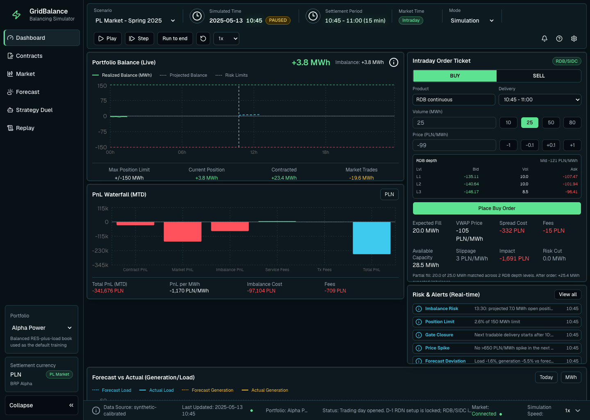
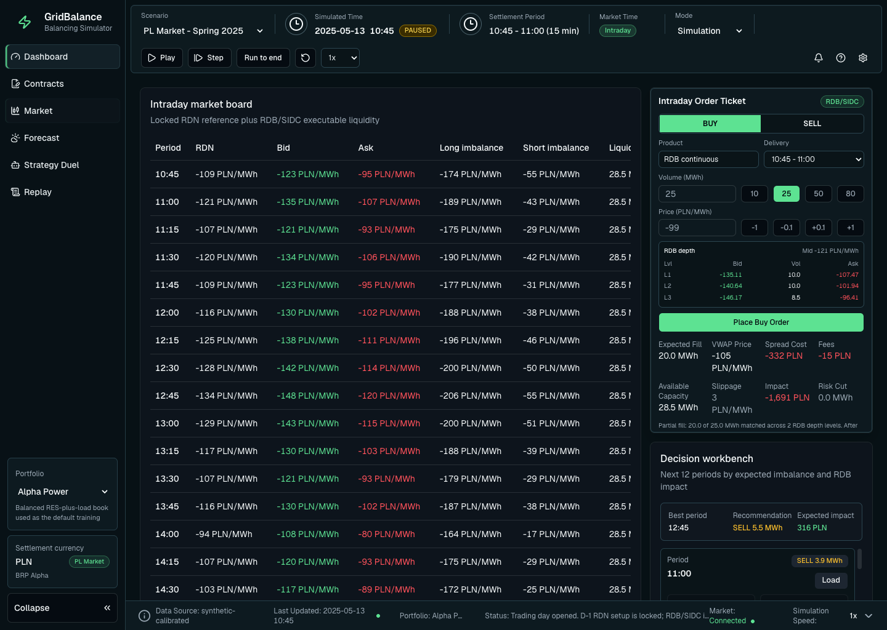
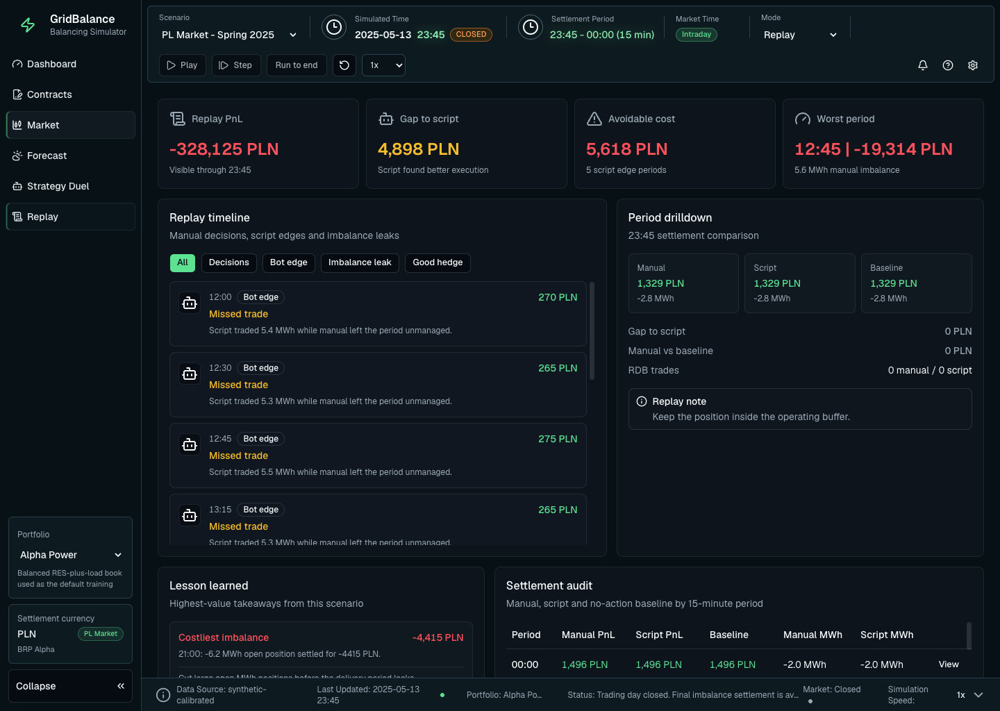
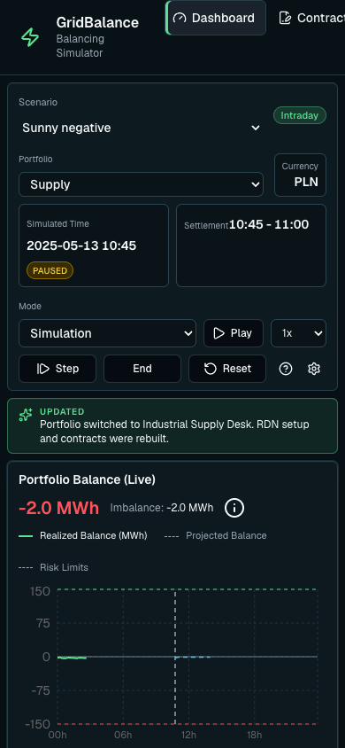

# Grid Balancing Tool

Grid Balancing Tool is an interactive simulator for learning how an electricity
portfolio behaves across a 15-minute trading day. It combines physical contract
books, day-ahead setup trades, intraday execution, imbalance settlement, and a
scripted strategy comparison into one desk-style application.

[Open the live demo](https://grid-balancing-tool.vercel.app)



The app is intentionally deterministic and local-first. It does not connect to
private company systems, market APIs, or real trading infrastructure. The goal
is to make portfolio balancing decisions visible, testable, and repeatable.

## What You Can Do

- Switch between realistic training portfolios with different default contract
  books, balancing parties, and exposure profiles.
- Work through six calibrated Polish power-market scenarios, including PV
  oversupply, wind drops, winter peaks, unit outages, and a hard-mode stress day.
- Trade simulated RDB/SIDC liquidity with limit prices, depth levels, VWAP,
  spread cost, fees, slippage, and partial fills.
- Edit the scenario seed and stress factors, preview the calibration impact, and
  rebuild the trading day deterministically.
- Compare manual trading against a no-future-sight autopilot strategy.
- Review the replay timeline, period drilldown, missed edges, imbalance leaks,
  and lessons after settlement.

The current market area is the Polish power market model. All monetary values
settle in PLN, and the UI treats PLN as the fixed settlement currency rather
than as an FX selector.

## Product Screens

### Intraday Market



### Replay And Lessons



### Mobile Dashboard



## Quality Bar

The release checks cover both domain logic and rendered application behavior:

- TypeScript and ESLint must pass.
- Vitest validates settlement math, data integrity, portfolio setup, scenario
  calibration, market execution, store transitions, strategy comparison, and
  replay analysis.
- The Playwright smoke test covers desktop and mobile flows: portfolio
  switching, scenario editing, trading, strategy duel, replay, and contract
  signing.
- Production build must complete successfully on Next.js 16.

## Data Integrity

Built-in data is validated before release. The integrity check fails on:

- duplicate scenario, portfolio, or contract identifiers;
- missing contract templates in a portfolio book;
- unsupported market or currency combinations;
- malformed 15-minute settlement periods;
- invalid day-ahead setup trades;
- non-finite settlement totals across scenario and portfolio combinations.

This keeps the local deterministic data honest instead of allowing a broken
portfolio or scenario to silently fall back to a different book.

## Tech Stack

- Next.js 16 App Router and React 19
- TypeScript
- Zustand for client-side simulation state
- Zod for runtime schemas
- shadcn/ui-style components
- Recharts and Motion
- Vitest for domain tests
- Playwright for smoke and screenshot validation
- Vercel for production hosting

## Run Locally

```bash
npm install
npm run dev
```

Open `http://localhost:3000`.

## Verification Commands

```bash
npm run typecheck
npm run lint
npm run test
npm run smoke
npm run build
```

`npm run smoke` expects the app to be running at `http://localhost:3000`. You
can override the target with `SMOKE_URL`.

## Project Structure

Core simulation logic lives in `src/lib/domain`:

- `scenarios.ts` creates seeded weather, load, OZE, market, and imbalance curves.
- `contracts.ts` evaluates physical contract volumes and prices.
- `portfolios.ts` defines selectable portfolio books and default templates.
- `markets.ts` validates RDB/SIDC orders, gate closure, depth, VWAP, fees, and
  partial fills.
- `settlement.ts` calculates period and portfolio PnL.
- `strategy.ts` runs the no-future-sight autopilot.
- `replay.ts` builds timeline events, lessons, and period comparisons.
- `data-integrity.ts` validates the built-in scenario, portfolio, contract, RDN
  setup, and settlement data.

UI state lives in `src/lib/store/simulation-store.ts`; the main app surface is
`src/components/grid-balancing-app.tsx`.

## Scope And Limitations

This is a production-quality educational simulator, not an operational trading
system. It uses synthetic calibrated data, simplified Polish/EU-style market
mechanics, and deterministic local state. Real deployment to a trading desk
would still require authenticated users, persisted scenarios, audited market
data imports, operational monitoring, and integration with approved trading and
settlement systems.

## Security Note

`npm audit` currently reports a moderate advisory through `next -> postcss`.
The suggested `npm audit fix --force` would downgrade Next.js to `9.3.3`, which
is a breaking and unsafe remediation for this app. Keep Next.js updated and
re-run audit when a compatible patched release is available.
